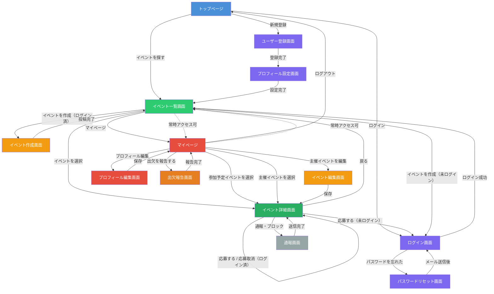
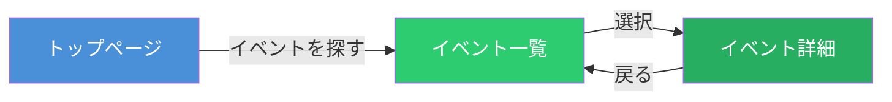
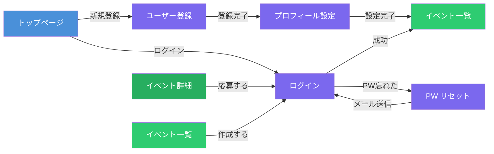
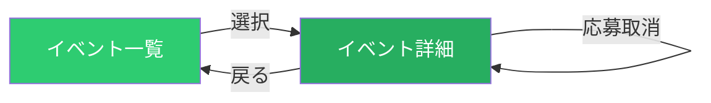
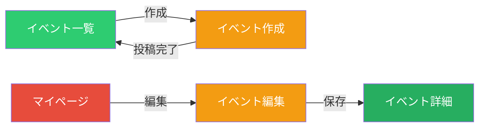
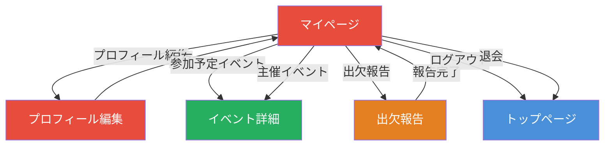
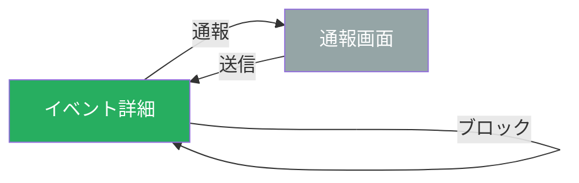

# メシとも — 画面遷移図

> **作成日:** 2026-03-14
> **バージョン:** 2.0

---

## 設計方針

ECサイトと同様に、**イベント一覧・詳細は未ログインでも閲覧可能**とする。
ただし、**応募・イベント作成・マイページ等のアクションにはログインが必要**。
未ログイン状態でアクション系ボタンを押した場合、ログイン画面へ誘導する。

---

## 全体遷移図

---

## フロー別の説明

### 1. 閲覧フロー（未ログインでもアクセス可）

| 遷移 | トリガー | 対応要件 | ログイン |
|------|---------|---------|---------|
| トップ → イベント一覧 | 「イベントを探す」ボタン | S-001 | 不要 |
| 一覧 → 詳細 | イベントカード選択 | S-001 | 不要 |
| 一覧での絞り込み | フィルター操作 | S-002〜S-005, S-007 | 不要 |

> **ポイント:** 未ログインユーザーでもイベントの閲覧・検索が可能。
> ただし性別フィルター（S-006）はプロフィール情報が必要なため、ログイン済みユーザーにのみ自動適用される。

---

### 2. 認証フロー

| 遷移 | トリガー | 対応要件 |
|------|---------|---------|
| トップ → 登録 | 「新規登録」ボタン | U-001, U-002 |
| トップ → ログイン | 「ログイン」ボタン | U-003 |
| イベント詳細 → ログイン | 未ログインで「応募する」押下 | — |
| イベント一覧 → ログイン | 未ログインで「イベントを作成」押下 | — |
| 登録 → プロフィール設定 | 登録完了後に自動遷移 | U-010〜U-013 |
| プロフィール設定 → イベント一覧 | 必須項目入力後 | — |
| ログイン → PW リセット | 「パスワードを忘れた方」リンク | U-004 |
| ログイン → イベント一覧 | 認証成功後 | U-003 |

> **ポイント:** 未ログイン状態でアクション系ボタン（応募・作成）を押すと、ログイン画面に誘導。
> ログイン/登録完了後、元の画面に戻る（リダイレクトバック）ことが望ましい。

---

### 3. イベント参加フロー（ログイン必須）

| 遷移 | トリガー | 対応要件 | ログイン |
|------|---------|---------|---------|
| 詳細で応募 | 「応募する」ボタン | E-020, E-023, E-024 | 必須 |
| 詳細で応募取消 | 「応募を取り消す」ボタン | E-021 | 必須 |

---

### 4. イベント作成フロー（ログイン必須）

| 遷移 | トリガー | 対応要件 | ログイン |
|------|---------|---------|---------|
| 一覧 → 作成 | 「イベントを作成」ボタン | E-001〜E-008 | 必須 |
| 作成 → 一覧 | 投稿完了後 | — | — |
| マイページ → 編集 | 主催イベントの「編集」 | E-009 | 必須 |
| マイページでイベント削除 | 「削除」ボタン | E-010 | 必須 |

---

### 5. マイページフロー（ログイン必須）

| 遷移 | トリガー | 対応要件 | ログイン |
|------|---------|---------|---------|
| マイページ → プロフィール編集 | 「編集」ボタン | U-014 | 必須 |
| マイページ → イベント詳細 | 参加/主催イベントを選択 | E-022, E-011 | 必須 |
| マイページ → 出欠報告 | 開催済みイベントの「報告」 | T-002 | 必須 |
| マイページ → ログアウト | 「ログアウト」 | U-003 | 必須 |
| マイページ → 退会 | 「退会する」 | U-005 | 必須 |

---

### 6. 安全対策フロー（ログイン必須）

| 遷移 | トリガー | 対応要件 | ログイン |
|------|---------|---------|---------|
| 詳細 → 通報 | 「通報する」ボタン | SF-001 | 必須 |
| 詳細でブロック | 「ブロック」ボタン（確認ダイアログ） | SF-002, SF-003 | 必須 |

---

## 画面一覧と認証要件

| 色 | カテゴリ | 画面 | ログイン |
|----|---------|------|---------|
| 🔵 青 | ランディング | トップページ | 不要 |
| 🟢 緑 | イベント閲覧 | イベント一覧 / イベント詳細 | **不要**（閲覧のみ） |
| 🟣 紫 | 認証系 | 登録 / ログイン / PW リセット / プロフィール初期設定 | 不要 |
| 🟠 オレンジ | イベント操作 | イベント作成 / 編集 / 出欠報告 | **必須** |
| 🔴 赤 | ユーザー管理 | マイページ / プロフィール編集 | **必須** |
| ⚪ グレー | 安全対策 | 通報画面 | **必須** |

---

## グローバルナビゲーション

### 未ログインユーザー

すべての画面で以下のナビゲーションを常時表示する。

| ナビ項目 | 遷移先 |
|---------|--------|
| イベント一覧 | イベント一覧画面 |
| ログイン | ログイン画面 |
| 新規登録 | ユーザー登録画面 |

### ログイン済みユーザー

すべての画面で以下のナビゲーションを常時表示する。

| ナビ項目 | 遷移先 |
|---------|--------|
| イベント一覧 | イベント一覧画面 |
| イベント作成 | イベント作成画面 |
| マイページ | マイページ |

---

## 未ログイン時のUI挙動まとめ

| 画面 | 要素 | 未ログイン時の挙動 |
|------|------|------------------|
| イベント一覧 | イベントカード | 通常通り表示・タップで詳細へ遷移 |
| イベント一覧 | フィルター | 予算・カテゴリ・地域・日付は使用可。性別フィルターは非表示または無効 |
| イベント一覧 | 「イベントを作成」ボタン | タップでログイン画面へ誘導 |
| イベント詳細 | イベント情報 | 通常通り表示 |
| イベント詳細 | 「応募する」ボタン | タップでログイン画面へ誘導（「参加するにはログインが必要です」等のメッセージ表示） |
| イベント詳細 | 通報・ブロック | 非表示 |
